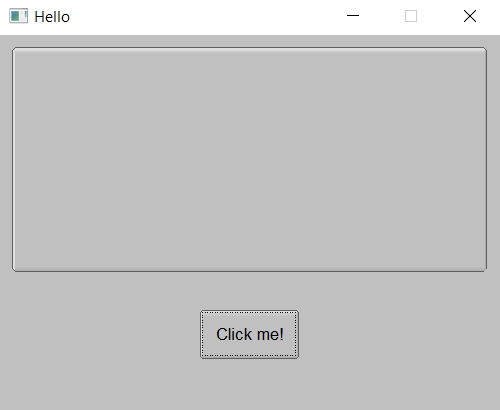
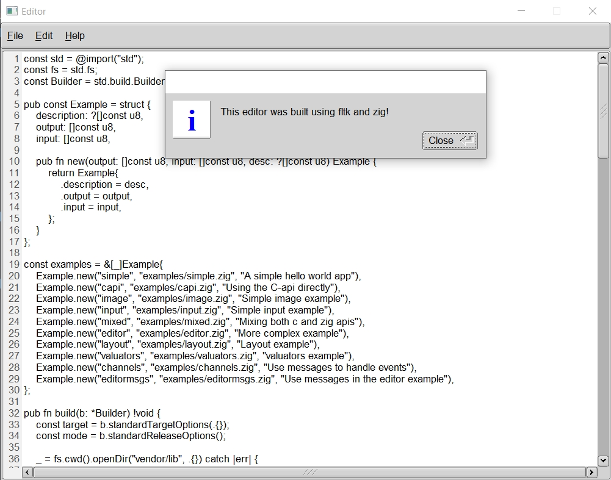

# zfltk
A Zig wrapper for the FLTK gui library.

## Running the examples
```
git clone https://github.com/MoAlyousef/zfltk --recurse-submodules
cd zfltk
zig build run-simple
zig build run-capi
zig build run-editor
zig build run-input
zig build run-image
zig build run-mixed
```

## Usage
Until an official Zig package manager is published, the easiest way to use the library is to add it as a subdirectory to your project, either via git submodules or git clone:
```
# via git submodule
git submodule add https://github.com/moalyousef/zfltk
cd zfltk
git checkout v011
cd ..
```
```
# via git clone
git clone https://github.com/moalyousef/zfltk
cd zfltk
git checkout v011
cd ..
```
then you will need a build.zig file as follows:
```zig
const std = @import("std");
const Sdk = @import("zfltk/build.zig");
const Builder = std.build.Builder;

pub fn build(b: *Builder) !void {
    const target = b.standardTargetOptions(.{});
    const mode = b.standardOptimizeOption(.{});
    const sdk = try Sdk.init(b);
    const exe = b.addExecutable(.{
        .name = "app",
        .root_source_file = .{.path = "src/main.zig" },
        .optimize = mode,
        .target = target,
    });
    const zfltk_module = b.createModule(.{
        .source_file = .{ .path = "zfltk/src/zfltk.zig" },
    });
    exe.addModule("zfltk", zfltk_module);
    try sdk.link(exe);
    b.installArtifact(exe);

    const run_cmd = b.addRunArtifact(exe);
    if (b.args) |args| {
        run_cmd.addArgs(args);
    }

    const run_step = b.step("run", "Run the app");
    run_step.dependOn(&run_cmd.step);
}
```
Then you can run:
```
zig build run
```

## Dependencies 

This repo tracks cfltk, the C bindings to FLTK. It (along with FLTK) is statically linked to your application.
This requires CMake (and Ninja on Windows) as a build system, and is only required once.

- Windows: No dependencies.
- MacOS: No dependencies.
- Linux: X11 and OpenGL development headers need to be installed for development. The libraries themselves are available on linux distros with a graphical user interface.

For Debian-based GUI distributions, that means running:
```
sudo apt-get install libx11-dev libxext-dev libxft-dev libxinerama-dev libxcursor-dev libxrender-dev libxfixes-dev libpango1.0-dev libpng-dev libgl1-mesa-dev libglu1-mesa-dev
```
For RHEL-based GUI distributions, that means running:
```
sudo yum groupinstall "X Software Development" && yum install pango-devel libXinerama-devel libpng-devel libstdc++-static
```
For Arch-based GUI distributions, that means running:
```
sudo pacman -S libx11 libxext libxft libxinerama libxcursor libxrender libxfixes libpng pango cairo libgl mesa --needed
```
For Alpine linux:
```
apk add pango-dev fontconfig-dev libxinerama-dev libxfixes-dev libxcursor-dev libpng-dev mesa-gl
```
For nixos:
```
nix-shell --packages rustc cmake git gcc xorg.libXext xorg.libXft xorg.libXinerama xorg.libXcursor xorg.libXrender xorg.libXfixes libcerf pango cairo libGL mesa pkg-config
```

## API
Using the Zig wrapper (under development):
```zig
const zfltk = @import("zfltk");
const app = zfltk.app;
const Window = zfltk.Window;
const Button = zfltk.Button;
const Box = zfltk.Box;
const Color = zfltk.enums.Color;

fn butCb(but: *Button(.normal), data: ?*anyopaque) void {
    var box = Box.fromRaw(data.?);

    box.setLabel("Hello World!");

    but.setColor(Color.fromName(.cyan));
}

pub fn main() !void {
    try app.init();
    app.setScheme(.gtk);

    var win = try Window.init(.{
        .w = 400,
        .h = 300,

        .label = "Hello",
    });

    var but = try Button(.normal).init(.{
        .x = 160,
        .y = 220,
        .w = 80,
        .h = 40,

        .label = "Click me!",
    });

    var box = try Box.init(.{
        .x = 10,
        .y = 10,
        .w = 380,
        .h = 180,

        .boxtype = .up,
    });

    box.setLabelFont(.courier);
    box.setLabelSize(18);

    win.group().end();
    win.widget().show();

    but.setCallbackEx(butCb, box);
    try app.run();
}
```
The messaging api can also be used:
```zig
const zfltk = @import("zfltk");
const app = zfltk.app;
const Widget = zfltk.Widget;
const Window = zfltk.Window;
const Button = zfltk.Button;
const Box = zfltk.Box;
const enums = zfltk.enums;

pub const Message = enum(usize) {
    // Can't begin with Zero!
    first = 1,
    second,
};

pub fn main() !void {
    try app.init();
    app.setScheme(.gtk);

    var win = try Window.init(.{
        .w = 400,
        .h = 300,

        .label = "Hello",
    });

    var but1 = try Button(.normal).init(.{
        .x = 100,
        .y = 220,
        .w = 80,
        .h = 40,

        .label = "Button 1",
    });

    var but2 = try Button(.normal).init(.{
        .x = 200,
        .y = 220,
        .w = 80,
        .h = 40,

        .label = "Button 2",
    });

    var mybox = try Box.init(.{
        .x = 10,
        .y = 10,
        .w = 380,
        .h = 180,

        .boxtype = .up,
    });

    mybox.setLabelFont(.courier);
    mybox.setLabelSize(18);

    win.group().end();
    win.show();
    but1.emit(Message, .first);
    but2.emit(Message, .second);

    while (app.wait()) {
        if (app.recv(Message)) |msg| switch (msg) {
            .first => mybox.setLabel("Button 1 Clicked!"),
            .second => mybox.setLabel("Button 2 Clicked!"),
        };
    }
}
```

Using the C Api directly:
```zig
const c = @cImport({
    @cInclude("cfl.h"); // Fl_run
    @cInclude("cfl_enums.h"); // Fl_Color_*
    @cInclude("cfl_button.h"); // Fl_Button
    @cInclude("cfl_box.h"); // Fl_Box
    @cInclude("cfl_window.h"); // Fl_Window
});

pub fn butCb(w: ?*c.Fl_Widget, data: ?*anyopaque) callconv(.C) void {
    c.Fl_Box_set_label(@ptrCast(?*c.Fl_Box, data), "Hello World!");
    c.Fl_Button_set_color(@ptrCast(?*c.Fl_Button, w), c.Fl_Color_Cyan);
}

pub fn main() void {
    c.Fl_set_scheme("gtk+");
    var win = c.Fl_Window_new(100, 100, 400, 300, "Hello");
    var but = c.Fl_Button_new(160, 220, 80, 40, "Click me!");
    var box = c.Fl_Box_new(10, 10, 380, 180, "");
    c.Fl_Window_end(win);
    c.Fl_Window_show(win);
    c.Fl_Button_set_callback(but, butCb, box);
    _ = c.Fl_run();
}
```
You can also mix and match for any missing functionalities in the Zig wrapper (see examples/mixed.zig)




